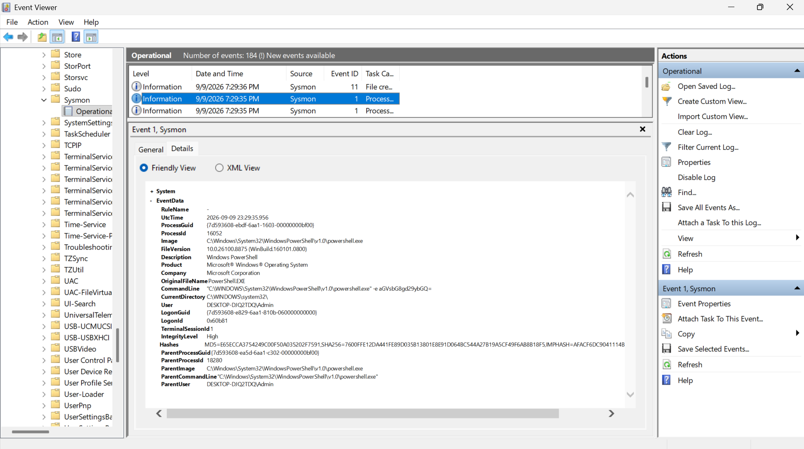

# Sysmon Threat Detection Lab: Obfuscated PowerShell Execution

## Project Overview
This project demonstrates endpoint telemetry enrichment and threat detection using **Microsoft Sysmon** with the SwiftOnSecurity baseline configuration. The objective is to identify suspicious execution behaviors, specifically PowerShell running encoded commands (`-EncodedCommand` / `-e`), a common technique used for defense evasion and initial execution in the MITRE ATT&CK framework (T1059.001).

## Implementation & Workflow
1. **Sysmon Deployment:** Installed Sysmon with a tuned XML baseline (`sysmonconfig-export.xml`) to log process creation events (**Event ID 1**) and hashes.
2. **Threat Simulation:** Executed an obfuscated Base64 PowerShell payload to trigger detection rules.
3. **Event Inspection:** Analyzed process creation metadata via Windows Event Viewer, isolating key telemetry fields including `CommandLine`, `ParentImage`, and binary execution hashes.

## Key Evidence

### Sysmon Event ID 1 Detection

*Figure 1: Detection of encoded PowerShell command execution captured via Sysmon Event ID 1.*

## Captured Telemetry Indicators

| Telemetry Field | Value / Detail | Security Relevance |
| :--- | :--- | :--- |
| **Event ID** | `1` | Process Creation |
| **Image** | `C:\Windows\System32\WindowsPowerShell\v1.0\powershell.exe` | Monitored Execution Utility |
| **CommandLine** | `powershell.exe -e <Base64_Payload>` | Encrypted/Obfuscated Payload Evasion |
| **Hashes** | `MD5 / SHA256` | Binary Integrity Assessment |

## Key Competencies Demonstrated
* **Endpoint Telemetry:** Configuring Sysmon for granular process tracking.
* **Threat Hunting:** Identifying suspicious command-line parameters and obfuscation indicators.
* **SOC Analysis:** Mapping endpoint events to threat detection methodologies.
